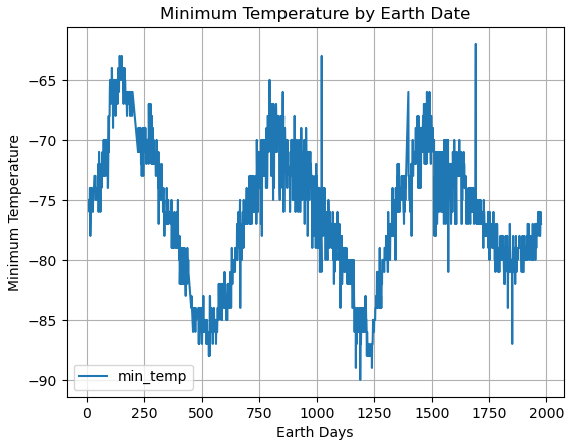

# web_scraping_challenge
In this challenge, Beautiful Soup is used to scrape data from a Mars News and Weather website.  Text elements are extracted from the html code of the website, and stored in python dictionaries.  
Mars Weather data are extracted from an html table, and are stored in a pandas dataframe for analysis.  The length of a Martian year is determined in part by plotting minimum temperature vs. # of eath days.  Minimum temperature on Mars peaks about every 700 earth days.

Additional Analysis:

Based on averages, the coldest month is the 3rd month, and the warmest month is the 8th month on Mars.
Again based on averages, the lowest pressures on Mars occur during the 6th month, with the highest pressures during the 9th pmonth.

A Martian year is approximately 700 days long.  This is the approximate time span between minimum temperature peaks over multiple Martian years.

I used this website to see how to split out the column headings from the html
https://www.freecodecamp.org/news/python-split-string-how-to-split-a-string-into-a-list-or-array-in-python/#:~:text=The%20split()%20method%20is,a%20list%20of%20these%20substrings.&text=In%20this%20example%2C%20we%20split,using%20the%20split()%20method

I had trouble for a while with getting the dates converted to datetime.  
This was a good problem to solve!

